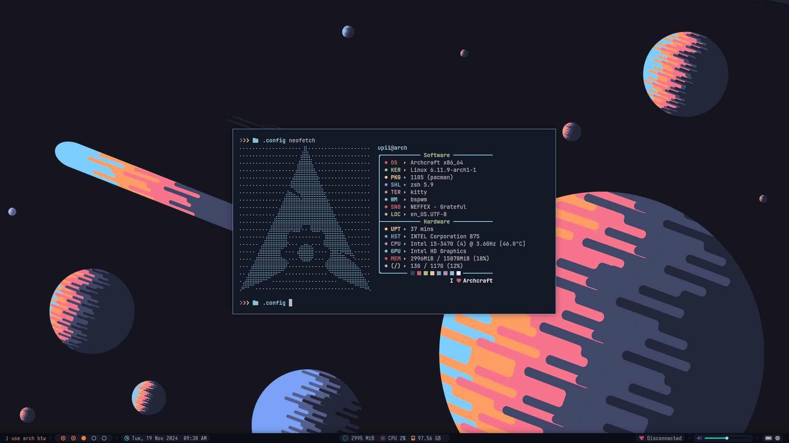
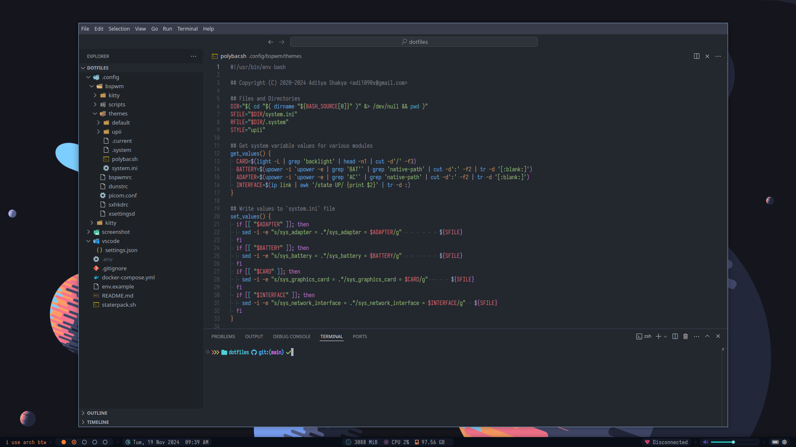

### Showcase ✌️
<p align="center"></p>

### 🚀 Customize my Linux

This is a dotfiles config that I customized for personal use, I made this config from `Archcraft`. For now I've only fully customized polybar, maybe in the future there will be more

- BSPWM
- Kitty

### ⌨️ Minimalize Visual Studio Code

<p align="center"></p>

How to Install?

- Copy the `settings.json` file to your user or workspace settings in VSCode.

For User Settings:

  - Windows:
    ```
    C:\Users\<Your Username>\AppData\Roaming\Code\User\settings.json
    ```
  - macOS:
    ```
    ~/Library/Application Support/Code/User/settings.json
    ```
  - Linux:
    ```
    ~/.config/Code/User/settings.json
    ```