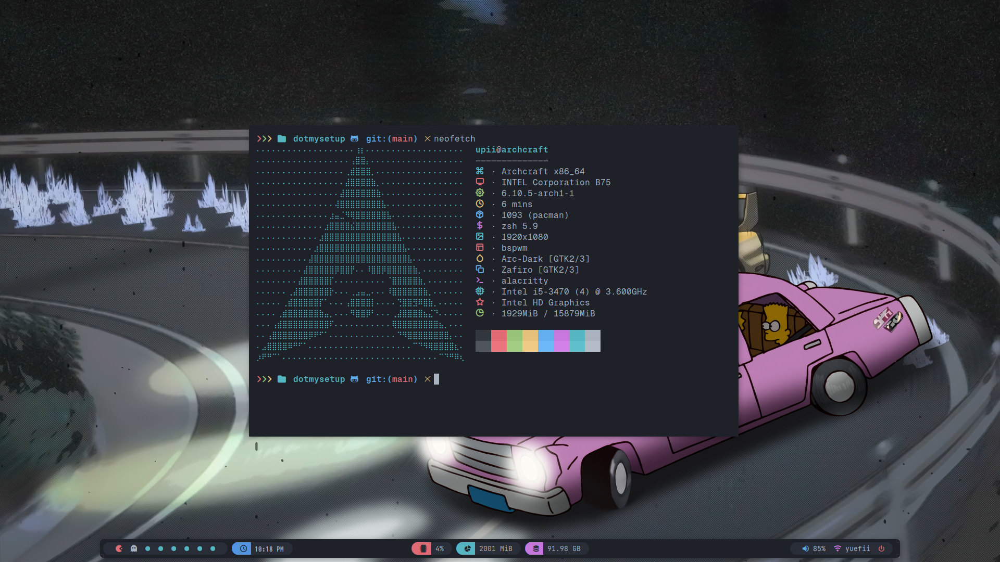
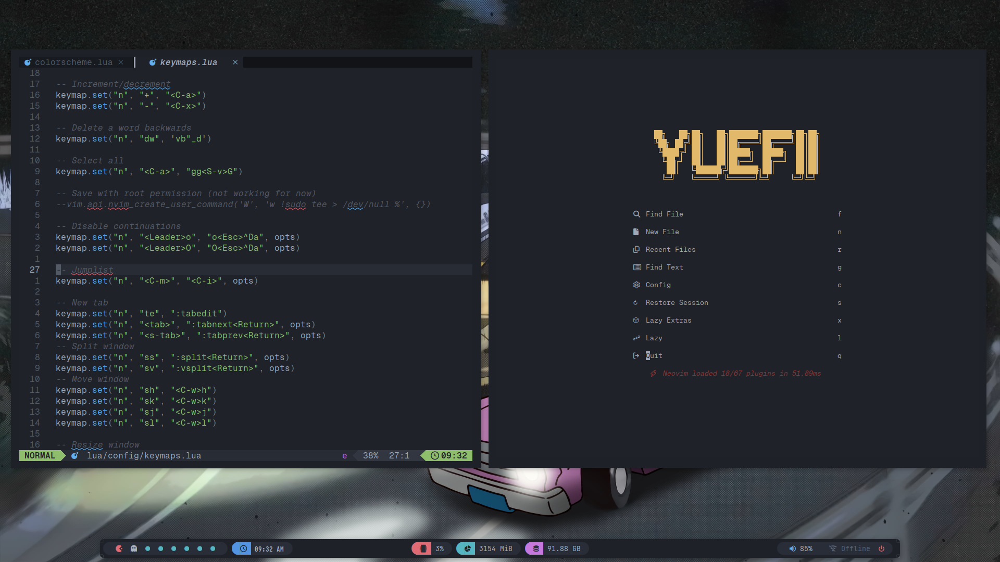

### Showcase ✌️

### 🚀 Customize my Linux

This is a dotfiles config that I customized for personal use, I made this config from `Archcraft`. For now I've only fully customized polybar, maybe in the future there will be more

- BSPWM
- Alacritty
- neovim - Lazy Vim